# cimon

Small CLI tool for generating markdown content towards providing graphical representation of github action workflow call graphs as mermaid flow chart diagrams.

## Usage

## Shallow Call Graph
An example usage for generating a (shallow) callgraph for a github actions workflow residing in a certain directory:

```bash
uv run cimon callgraph -w ~/app-adas-src/.github/workflows/pr.yml
```

Example output:

```mermaid
flowchart TD
pr_check_changed_files["check-changed-files"]
pr_quick_pr_checks["quick-pr-checks"]
pr_check_changed_files --> pr_quick_pr_checks
pr_build_pr_targets["build-pr-targets"]
pr_check_changed_files --> pr_build_pr_targets
pr_quick_pr_checks --> pr_build_pr_targets
used____github_workflows_reusable_bazel_build_yml["./.github/workflows/reusable_bazel_build.yml"]
pr_build_pr_targets -->|build-pr-targets| used____github_workflows_reusable_bazel_build_yml
pr_validate_sil_generation["validate-sil-generation"]
pr_check_changed_files --> pr_validate_sil_generation
pr_build_pr_targets --> pr_validate_sil_generation
pr_unit_and_sw_tests["unit-and-sw-tests"]
pr_check_changed_files --> pr_unit_and_sw_tests
used____github_workflows_reusable_test_unit_and_sw_yml["./.github/workflows/reusable_test_unit_and_sw.yml"]
pr_unit_and_sw_tests -->|unit-and-sw-tests| used____github_workflows_reusable_test_unit_and_sw_yml
pr_sol_tests["sol-tests"]
pr_check_changed_files --> pr_sol_tests
used____github_workflows_reusable_test_sol_yml["./.github/workflows/reusable_test_sol.yml"]
pr_sol_tests -->|sol-tests| used____github_workflows_reusable_test_sol_yml
pr_pol_idbuzz_adas_pure_plus_8650_qc_release_tests["pol-idbuzz-adas-pure-plus-8650-qc-release-tests"]
pr_check_changed_files --> pr_pol_idbuzz_adas_pure_plus_8650_qc_release_tests
used____github_workflows_reusable_test_pol_yml["./.github/workflows/reusable_test_pol.yml"]
pr_pol_idbuzz_adas_pure_plus_8650_qc_release_tests -->|pol-idbuzz-adas-pure-plus-8650-qc-release-tests| used____github_workflows_reusable_test_pol_yml
pr_sil_tests["sil-tests"]
pr_check_changed_files --> pr_sil_tests
used____github_workflows_reusable_test_sil_yml["./.github/workflows/reusable_test_sil.yml"]
pr_sil_tests -->|sil-tests| used____github_workflows_reusable_test_sil_yml
pr_tool_test["tool-test"]
pr_check_changed_files --> pr_tool_test
used____github_workflows_reusable_test_tools_yml["./.github/workflows/reusable_test_tools.yml"]
pr_tool_test -->|tool-test| used____github_workflows_reusable_test_tools_yml
pr_bazel_smoke_tests["bazel-smoke-tests"]
pr_check_changed_files --> pr_bazel_smoke_tests
used____github_workflows_reusable_bazel_smoke_test_yml["./.github/workflows/reusable_bazel_smoke_test.yml"]
pr_bazel_smoke_tests -->|bazel-smoke-tests| used____github_workflows_reusable_bazel_smoke_test_yml
pr_hmimgr_swe6_tests["hmimgr-swe6-tests"]
pr_check_changed_files --> pr_hmimgr_swe6_tests
used____github_workflows_hmimgr_swe6_tests_yml["./.github/workflows/hmimgr_swe6_tests.yml"]
pr_hmimgr_swe6_tests -->|hmimgr-swe6-tests| used____github_workflows_hmimgr_swe6_tests_yml

classDef jobNode fill:#add8e6,stroke:#333,color:#000;
class pr_check_changed_files,pr_quick_pr_checks,pr_build_pr_targets,pr_validate_sil_generation,pr_unit_and_sw_tests,pr_sol_tests,pr_pol_idbuzz_adas_pure_plus_8650_qc_release_tests,pr_sil_tests,pr_tool_test,pr_bazel_smoke_tests,pr_hmimgr_swe6_tests jobNode;
classDef usesNode fill:#ffa500,stroke:#333,color:#000;
class used____github_workflows_reusable_bazel_build_yml,used____github_workflows_reusable_test_unit_and_sw_yml,used____github_workflows_reusable_test_sol_yml,used____github_workflows_reusable_test_pol_yml,used____github_workflows_reusable_test_sil_yml,used____github_workflows_reusable_test_tools_yml,used____github_workflows_reusable_bazel_smoke_test_yml,used____github_workflows_hmimgr_swe6_tests_yml usesNode;
```



## Deep Call Graph

If subsequent nested and re-used workflows shall be shown as subgraphs provide the `-d` option:
```bash
uv run cimon callgraph -w ~/app-adas-src/.github/workflows/pr.yml -d
```

An example graphical representation could be like:

```mermaid
flowchart TD;
pr_check_changed_files["check-changed-files"]
pr_quick_pr_checks["quick-pr-checks"]
pr_check_changed_files --> pr_quick_pr_checks
pr_build_pr_targets["build-pr-targets"]
pr_check_changed_files --> pr_build_pr_targets
pr_quick_pr_checks --> pr_build_pr_targets
subgraph used____github_workflows_reusable_bazel_build_yml ["./.github/workflows/reusable_bazel_build.yml"]
    reusable_bazel_build_parallel_bazel_builds["parallel-bazel-builds"]
    reusable_bazel_build_sequential_bazel_builds["sequential-bazel-builds"]

    classDef jobNode fill:#add8e6,stroke:#333,color:#000;
    class reusable_bazel_build_parallel_bazel_builds,reusable_bazel_build_sequential_bazel_builds jobNode;
end
pr_build_pr_targets -->|build-pr-targets| used____github_workflows_reusable_bazel_build_yml
pr_validate_sil_generation["validate-sil-generation"]
pr_check_changed_files --> pr_validate_sil_generation
pr_build_pr_targets --> pr_validate_sil_generation
pr_unit_and_sw_tests["unit-and-sw-tests"]
pr_check_changed_files --> pr_unit_and_sw_tests
subgraph used____github_workflows_reusable_test_unit_and_sw_yml ["./.github/workflows/reusable_test_unit_and_sw.yml"]
    reusable_test_unit_and_sw_unit_software_test["unit-software-test"]

    classDef jobNode fill:#add8e6,stroke:#333,color:#000;
    class reusable_test_unit_and_sw_unit_software_test jobNode;
end
pr_unit_and_sw_tests -->|unit-and-sw-tests| used____github_workflows_reusable_test_unit_and_sw_yml
pr_sol_tests["sol-tests"]
pr_check_changed_files --> pr_sol_tests
subgraph used____github_workflows_reusable_test_sol_yml ["./.github/workflows/reusable_test_sol.yml"]
    reusable_test_sol_sol_tests_adas_high_x86_release["sol-tests-adas_high_x86_release"]
    reusable_test_sol_sol_tests_adas_pure_plus_x86_release["sol-tests-adas_pure_plus_x86_release"]

    classDef jobNode fill:#add8e6,stroke:#333,color:#000;
    class reusable_test_sol_sol_tests_adas_high_x86_release,reusable_test_sol_sol_tests_adas_pure_plus_x86_release jobNode;
end
pr_sol_tests -->|sol-tests| used____github_workflows_reusable_test_sol_yml
pr_pol_idbuzz_adas_pure_plus_8650_qc_release_tests["pol-idbuzz-adas-pure-plus-8650-qc-release-tests"]
pr_check_changed_files --> pr_pol_idbuzz_adas_pure_plus_8650_qc_release_tests
subgraph used____github_workflows_reusable_test_pol_yml ["./.github/workflows/reusable_test_pol.yml"]
    reusable_test_pol_acquire_test_bench["acquire-test-bench"]
    reusable_test_pol_run_recompute["run-recompute"]
    reusable_test_pol_acquire_test_bench --> reusable_test_pol_run_recompute
    reusable_test_pol_release_test_bench["release-test-bench"]
    reusable_test_pol_acquire_test_bench --> reusable_test_pol_release_test_bench
    reusable_test_pol_run_recompute --> reusable_test_pol_release_test_bench
    reusable_test_pol_cleanup_locks --> reusable_test_pol_release_test_bench
    reusable_test_pol_cleanup_locks["cleanup-locks"]
    reusable_test_pol_acquire_test_bench --> reusable_test_pol_cleanup_locks

    classDef jobNode fill:#add8e6,stroke:#333,color:#000;
    class reusable_test_pol_acquire_test_bench,reusable_test_pol_run_recompute,reusable_test_pol_release_test_bench,reusable_test_pol_cleanup_locks jobNode;
end
pr_pol_idbuzz_adas_pure_plus_8650_qc_release_tests -->|pol-idbuzz-adas-pure-plus-8650-qc-release-tests| used____github_workflows_reusable_test_pol_yml
pr_sil_tests["sil-tests"]
pr_check_changed_files --> pr_sil_tests
subgraph used____github_workflows_reusable_test_sil_yml ["./.github/workflows/reusable_test_sil.yml"]
    reusable_test_sil_sil_test_setup["sil-test-setup"]
    reusable_test_sil_sil_tests["sil-tests"]
    reusable_test_sil_sil_test_setup --> reusable_test_sil_sil_tests

    classDef jobNode fill:#add8e6,stroke:#333,color:#000;
    class reusable_test_sil_sil_test_setup,reusable_test_sil_sil_tests jobNode;
end
pr_sil_tests -->|sil-tests| used____github_workflows_reusable_test_sil_yml
pr_tool_test["tool-test"]
pr_check_changed_files --> pr_tool_test
subgraph used____github_workflows_reusable_test_tools_yml ["./.github/workflows/reusable_test_tools.yml"]
    reusable_test_tools_tool_test["tool-test"]

    classDef jobNode fill:#add8e6,stroke:#333,color:#000;
    class reusable_test_tools_tool_test jobNode;
end
pr_tool_test -->|tool-test| used____github_workflows_reusable_test_tools_yml
pr_bazel_smoke_tests["bazel-smoke-tests"]
pr_check_changed_files --> pr_bazel_smoke_tests
subgraph used____github_workflows_reusable_bazel_smoke_test_yml ["./.github/workflows/reusable_bazel_smoke_test.yml"]
    reusable_bazel_smoke_test_bazel_query_smoke_tests["bazel-query-smoke-tests"]

    classDef jobNode fill:#add8e6,stroke:#333,color:#000;
    class reusable_bazel_smoke_test_bazel_query_smoke_tests jobNode;
end
pr_bazel_smoke_tests -->|bazel-smoke-tests| used____github_workflows_reusable_bazel_smoke_test_yml
pr_hmimgr_swe6_tests["hmimgr-swe6-tests"]
pr_check_changed_files --> pr_hmimgr_swe6_tests
subgraph used____github_workflows_hmimgr_swe6_tests_yml ["./.github/workflows/hmimgr_swe6_tests.yml"]
    hmimgr_swe6_tests_hmimgr_swe6_tests["hmimgr-swe6-tests"]

    classDef jobNode fill:#add8e6,stroke:#333,color:#000;
    class hmimgr_swe6_tests_hmimgr_swe6_tests jobNode;
end
pr_hmimgr_swe6_tests -->|hmimgr-swe6-tests| used____github_workflows_hmimgr_swe6_tests_yml

classDef jobNode fill:#add8e6,stroke:#333,color:#000;
class pr_check_changed_files,pr_quick_pr_checks,pr_build_pr_targets,pr_validate_sil_generation,pr_unit_and_sw_tests,pr_sol_tests,pr_pol_idbuzz_adas_pure_plus_8650_qc_release_tests,pr_sil_tests,pr_tool_test,pr_bazel_smoke_tests,pr_hmimgr_swe6_tests jobNode;
classDef usesNode fill:#ffa500,stroke:#333,color:#000;
class used____github_workflows_reusable_bazel_build_yml,used____github_workflows_reusable_test_unit_and_sw_yml,used____github_workflows_reusable_test_sol_yml,used____github_workflows_reusable_test_pol_yml,used____github_workflows_reusable_test_sil_yml,used____github_workflows_reusable_test_tools_yml,used____github_workflows_reusable_bazel_smoke_test_yml,used____github_workflows_hmimgr_swe6_tests_yml usesNode;
```




Note:
It is usefull to have the following Visual Studio Code Extensions be installed:
- File Hive (for inspecting e.g. parquet files)
- Call Graph Explorer (to visualize function callings and function dependencies)