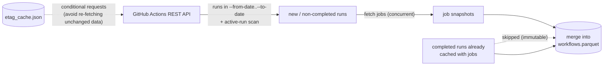
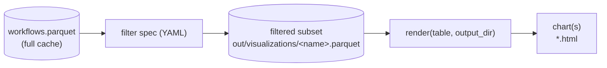

# cimon

Small CLI tool for tracking github action workflow runs related data.

> **Note:**
>   It is usefull to have the following Visual Studio Code Extensions be installed:
>   - PK Parquet Viewer (for inspecting e.g. parquet files)
>   - Call Graph Explorer (to visualize function callings and function dependencies)

## Purpose

`cimon` helps track and understand the health of a repository's GitHub
Actions CI over time. Rather than clicking through the GitHub Actions UI run
by run, it collects workflow-run and job history into a local, queryable
cache and builds tooling on top of it:

- **Caching** -- incrementally sync workflow runs and jobs from the GitHub
  API into a local Parquet cache, without re-fetching data that hasn't
  changed.
- **Querying** -- filter that cache declaratively (Python API, YAML/JSON spec
  files, or the `query` CLI command) to answer questions like "which jobs
  failed in the last week" or "which runners are currently busy".
- **Visualizing** -- turn filtered cache data into charts (job durations,
  runner utilization, ...) through a small, pluggable rendering pipeline.
- **Call graphs** -- render a workflow's job/reusable-workflow structure as a
  Mermaid diagram, to understand how its jobs and called workflows relate.

### Caching

`cimon sync` fetches GitHub Actions workflow-run and job data via the GitHub
REST API and persists it into a local, append/merge-able Parquet cache
(`workflows.parquet`, one row per run **and** job -- see
[Querying the workflows cache](docs/references/workflow-query.md) for the
row layout). Every other feature that works with workflow-run data (`query`,
`visualize`, `cache-info`) reads from this cache, not the API directly.



To keep repeated syncs fast and light on the API quota:

- **Completed runs whose jobs are already cached are treated as immutable**
  and are not re-queried -- only new runs and still `in_progress`/`queued`
  runs get their job list re-fetched.
- An **ETag cache** (`etag_cache.json`) makes conditional GET requests, so
  unchanged pages return `304 Not Modified` instead of a full payload.
- A separate **active-run scan** (independent of `--from-date`/`--to-date`)
  catches runs that are still active but fell outside the requested date
  range -- important because GitHub's API silently caps pagination at 1000
  results on busy days.

Everything above is merged into `workflows.parquet` under `--cache-dir`
(default `~/.cache/cimon`), alongside `response.json` (a snapshot of just the
last sync request, not the cumulative cache) and `etag_cache.json`.

#### Example: updating the cache

```bash
uv run cimon sync --workflow pr.yml --from-date 2026-08-01 --to-date 2026-08-31 --cache-dir .
```

```bash
Fetching workflow runs ... done (303 runs found)
Workflow runs requiring job update: 12
Cache update completed.
ETag cache:   etag_cache.json (4.1 KB)
GH Response:  response.json (128.4 KB)
    Runs:     303 (2 new, 301 known)
Cache:        workflows.parquet (598.0 KB)
```

Inspect the resulting cache without re-fetching anything:

```bash
uv run cimon cache-info --cache-dir .
```

```bash
Parquet cache: workflows.parquet (598.0 KB)
      .github/workflows/pr.yml (303 RUNS)
      .github/workflows/gitlint.yml (331 RUNS)
      .github/workflows/qg_cas_build_and_test.yml (645 RUNS)
      ...
```

To keep every workflow that's actually triggered on pull requests up to
date in one go, see
[`scripts/update_workflow_cache.sh`](scripts/update_workflow_cache.sh), which
loops `cimon sync` over every workflow file referencing `pull_request`/
`merge_group` and syncs each one from today's date.

#### Edge case: negative `job_duration_sec`

For jobs that never actually ran (mostly `skipped`, occasionally
`cancelled`), GitHub's API can report `completed_at` a few seconds *before*
`started_at`, which would otherwise yield a negative `job_duration_sec`.
`cimon` clamps this to `None` instead. Because "completed runs whose jobs
are already cached are immutable" (see above), a run whose jobs were synced
before this clamp existed keeps a stale, wrong value in
`workflows.parquet` until that run's jobs are rebuilt from their cached
`started_at`/`completed_at` -- which happens automatically the next time the
run is synced (no extra API calls needed), but only for runs within the
sync's requested date range / active-run scan.

To fix already-cached, out-of-range history in one go without touching the
GitHub API, run:

```bash
uv run cimon repair-cache --cache-dir .
```

#### Quota

Since every sync consumes GitHub API quota, check how much is left (reads
`GH_TOKEN`/`GITHUB_TOKEN` and `GH_HOST` from the environment, same as `sync`):

```bash
uv run cimon quota
```

```bash
GitHub API quota:
  Limit:     15000
  Used:      342
  Remaining: 14658
  Reset:     2026-08-31 16:00:00+00:00
```

#### Aborting a sync before quota runs out

The same token is often shared with other tools/scripts (e.g. other CI jobs,
or someone using the GitHub web UI), and GitHub also enforces secondary/abuse
rate limits independent of the plain remaining-count. Running a sync all the
way down to 0 remaining requests is therefore riskier than necessary, and
what quota is "safe" to leave as a buffer differs per environment (GitHub
Enterprise Server instances can configure their own, often lower, limits).

`cimon sync` accepts `--quota-limit N` to stop once the remaining quota
drops to/below `N`, instead of running until the API itself starts rejecting
requests:

```bash
uv run cimon sync --workflow pr.yml --from-date 2026-08-01 --quota-limit 200
```

If `--quota-limit` isn't given, it defaults to 10% of the token's actual rate
limit ceiling (e.g. `500` for a `5000`-limit token, `1500` for `15000`) --
picked up automatically from `/rate_limit`, so every sync stays protected
without requiring opt-in. Pass an absolute `--quota-limit` to override this.

This is checked twice:

- **Before** any work starts (a free `/rate_limit` check that doesn't itself
  consume quota), so a sync that's already doomed fails fast instead of
  fetching workflow runs first.
- **During** the sync, after every API response -- since a single sync can
  consume far more quota than expected (e.g. an unusually busy day). Runs and
  jobs already fetched at that point are still saved to the cache before the
  sync aborts, so nothing already fetched is wasted -- the next sync picks up
  where this one left off (any run left without jobs is simply re-fetched,
  since it isn't recognized as "complete" yet).

### Querying

Once `workflows.parquet` is populated, filter it down to answer questions
like "which jobs failed in the last week" or "which runners are currently
busy" -- without writing any pyarrow/DuckDB code. A filter can be expressed
three ways, all compiling to the same `pyarrow.dataset` expressions:

- a fluent Python builder (`WorkflowQuery`), for ad-hoc use in scripts/notebooks;
- a declarative YAML/JSON **spec file**, for anything that needs to be
  supplied dynamically (a CLI flag, a saved config, ...) -- and reused as-is
  by both the `query` CLI command and `cimon visualize` (see
  [Visualizations](#visualizations) below);
- the `cimon query` CLI command, which applies a spec file to a Parquet cache
  and writes the filtered rows to a new Parquet file.

#### Example: filtering with a spec file

```yaml
# tests/example_specs/filter_by_job_name.yml
all:
  - column: created_at
    op: between
    value: ["2026-08-01T00:00:00Z", "2026-08-31T23:59:59Z"]
  - column: job_conclusion
    op: eq
    value: success
  - column: job_name
    op: contains
    value: "Build"
```

```bash
uv run cimon query -i workflows.parquet -s tests/example_specs/filter_by_job_name.yml -o out/filtered.parquet
```

```bash
Wrote 128 filtered row(s) to out/filtered.parquet
```

Add `-c/--column` (repeatable) to restrict the output to specific columns,
e.g. `-c run_id -c job_name -c job_duration_sec`.

#### Example: filtering from Python

```python
from cimon.workflows.query import WorkflowQuery

rows = (
    WorkflowQuery("workflows.parquet")
    .job_status("in_progress")
    .runner_label("app-adas-src")
    .columns("run_id", "job_name", "job_runner_labels")
    .to_pylist()
)
```

Each row is one **job** belonging to one **run** (run-level columns like
`run_id`/`workflow_status`/`created_at` repeat across every job row of that
run). See
[Querying the workflows cache](docs/references/workflow-query.md) for the
full row layout, the complete list of supported operators (`eq`, `between`,
`contains`, `list_contains`, ...), and more `WorkflowQuery` examples.

## Features


### Callgraph

#### Shallow Call Graph
An example usage for generating a (shallow) callgraph for a github actions workflow residing in a certain directory:

```bash
uv run cimon callgraph -w ~/app-adas-src/.github/workflows/pr.yml
```

Example output:

```mermaid
flowchart TD
pr_check_changed_files["check-changed-files"]
pr_quick_pr_checks["quick-pr-checks"]
pr_check_changed_files --> pr_quick_pr_checks
pr_build_pr_targets["build-pr-targets"]
pr_check_changed_files --> pr_build_pr_targets
pr_quick_pr_checks --> pr_build_pr_targets
used____github_workflows_reusable_bazel_build_yml["./.github/workflows/reusable_bazel_build.yml"]
pr_build_pr_targets -->|build-pr-targets| used____github_workflows_reusable_bazel_build_yml
pr_validate_sil_generation["validate-sil-generation"]
pr_check_changed_files --> pr_validate_sil_generation
pr_build_pr_targets --> pr_validate_sil_generation
pr_unit_and_sw_tests["unit-and-sw-tests"]
pr_check_changed_files --> pr_unit_and_sw_tests
used____github_workflows_reusable_test_unit_and_sw_yml["./.github/workflows/reusable_test_unit_and_sw.yml"]
pr_unit_and_sw_tests -->|unit-and-sw-tests| used____github_workflows_reusable_test_unit_and_sw_yml
pr_sol_tests["sol-tests"]
pr_check_changed_files --> pr_sol_tests
used____github_workflows_reusable_test_sol_yml["./.github/workflows/reusable_test_sol.yml"]
pr_sol_tests -->|sol-tests| used____github_workflows_reusable_test_sol_yml
pr_pol_idbuzz_adas_pure_plus_8650_qc_release_tests["pol-idbuzz-adas-pure-plus-8650-qc-release-tests"]
pr_check_changed_files --> pr_pol_idbuzz_adas_pure_plus_8650_qc_release_tests
used____github_workflows_reusable_test_pol_yml["./.github/workflows/reusable_test_pol.yml"]
pr_pol_idbuzz_adas_pure_plus_8650_qc_release_tests -->|pol-idbuzz-adas-pure-plus-8650-qc-release-tests| used____github_workflows_reusable_test_pol_yml
pr_sil_tests["sil-tests"]
pr_check_changed_files --> pr_sil_tests
used____github_workflows_reusable_test_sil_yml["./.github/workflows/reusable_test_sil.yml"]
pr_sil_tests -->|sil-tests| used____github_workflows_reusable_test_sil_yml
pr_tool_test["tool-test"]
pr_check_changed_files --> pr_tool_test
used____github_workflows_reusable_test_tools_yml["./.github/workflows/reusable_test_tools.yml"]
pr_tool_test -->|tool-test| used____github_workflows_reusable_test_tools_yml
pr_bazel_smoke_tests["bazel-smoke-tests"]
pr_check_changed_files --> pr_bazel_smoke_tests
used____github_workflows_reusable_bazel_smoke_test_yml["./.github/workflows/reusable_bazel_smoke_test.yml"]
pr_bazel_smoke_tests -->|bazel-smoke-tests| used____github_workflows_reusable_bazel_smoke_test_yml
pr_hmimgr_swe6_tests["hmimgr-swe6-tests"]
pr_check_changed_files --> pr_hmimgr_swe6_tests
used____github_workflows_hmimgr_swe6_tests_yml["./.github/workflows/hmimgr_swe6_tests.yml"]
pr_hmimgr_swe6_tests -->|hmimgr-swe6-tests| used____github_workflows_hmimgr_swe6_tests_yml

classDef jobNode fill:#add8e6,stroke:#333,color:#000;
class pr_check_changed_files,pr_quick_pr_checks,pr_build_pr_targets,pr_validate_sil_generation,pr_unit_and_sw_tests,pr_sol_tests,pr_pol_idbuzz_adas_pure_plus_8650_qc_release_tests,pr_sil_tests,pr_tool_test,pr_bazel_smoke_tests,pr_hmimgr_swe6_tests jobNode;
classDef usesNode fill:#ffa500,stroke:#333,color:#000;
class used____github_workflows_reusable_bazel_build_yml,used____github_workflows_reusable_test_unit_and_sw_yml,used____github_workflows_reusable_test_sol_yml,used____github_workflows_reusable_test_pol_yml,used____github_workflows_reusable_test_sil_yml,used____github_workflows_reusable_test_tools_yml,used____github_workflows_reusable_bazel_smoke_test_yml,used____github_workflows_hmimgr_swe6_tests_yml usesNode;
```



#### Deep Call Graph

If subsequent nested and re-used workflows shall be shown as subgraphs provide the `-d` option:
```bash
uv run cimon callgraph -w ~/app-adas-src/.github/workflows/pr.yml -d
```

An example graphical representation could be like:

```mermaid
flowchart TD;
pr_check_changed_files["check-changed-files"]
pr_quick_pr_checks["quick-pr-checks"]
pr_check_changed_files --> pr_quick_pr_checks
pr_build_pr_targets["build-pr-targets"]
pr_check_changed_files --> pr_build_pr_targets
pr_quick_pr_checks --> pr_build_pr_targets
subgraph used____github_workflows_reusable_bazel_build_yml ["./.github/workflows/reusable_bazel_build.yml"]
    reusable_bazel_build_parallel_bazel_builds["parallel-bazel-builds"]
    reusable_bazel_build_sequential_bazel_builds["sequential-bazel-builds"]

    classDef jobNode fill:#add8e6,stroke:#333,color:#000;
    class reusable_bazel_build_parallel_bazel_builds,reusable_bazel_build_sequential_bazel_builds jobNode;
end
pr_build_pr_targets -->|build-pr-targets| used____github_workflows_reusable_bazel_build_yml
pr_validate_sil_generation["validate-sil-generation"]
pr_check_changed_files --> pr_validate_sil_generation
pr_build_pr_targets --> pr_validate_sil_generation
pr_unit_and_sw_tests["unit-and-sw-tests"]
pr_check_changed_files --> pr_unit_and_sw_tests
subgraph used____github_workflows_reusable_test_unit_and_sw_yml ["./.github/workflows/reusable_test_unit_and_sw.yml"]
    reusable_test_unit_and_sw_unit_software_test["unit-software-test"]

    classDef jobNode fill:#add8e6,stroke:#333,color:#000;
    class reusable_test_unit_and_sw_unit_software_test jobNode;
end
pr_unit_and_sw_tests -->|unit-and-sw-tests| used____github_workflows_reusable_test_unit_and_sw_yml
pr_sol_tests["sol-tests"]
pr_check_changed_files --> pr_sol_tests
subgraph used____github_workflows_reusable_test_sol_yml ["./.github/workflows/reusable_test_sol.yml"]
    reusable_test_sol_sol_tests_adas_high_x86_release["sol-tests-adas_high_x86_release"]
    reusable_test_sol_sol_tests_adas_pure_plus_x86_release["sol-tests-adas_pure_plus_x86_release"]

    classDef jobNode fill:#add8e6,stroke:#333,color:#000;
    class reusable_test_sol_sol_tests_adas_high_x86_release,reusable_test_sol_sol_tests_adas_pure_plus_x86_release jobNode;
end
pr_sol_tests -->|sol-tests| used____github_workflows_reusable_test_sol_yml
pr_pol_idbuzz_adas_pure_plus_8650_qc_release_tests["pol-idbuzz-adas-pure-plus-8650-qc-release-tests"]
pr_check_changed_files --> pr_pol_idbuzz_adas_pure_plus_8650_qc_release_tests
subgraph used____github_workflows_reusable_test_pol_yml ["./.github/workflows/reusable_test_pol.yml"]
    reusable_test_pol_acquire_test_bench["acquire-test-bench"]
    reusable_test_pol_run_recompute["run-recompute"]
    reusable_test_pol_acquire_test_bench --> reusable_test_pol_run_recompute
    reusable_test_pol_release_test_bench["release-test-bench"]
    reusable_test_pol_acquire_test_bench --> reusable_test_pol_release_test_bench
    reusable_test_pol_run_recompute --> reusable_test_pol_release_test_bench
    reusable_test_pol_cleanup_locks --> reusable_test_pol_release_test_bench
    reusable_test_pol_cleanup_locks["cleanup-locks"]
    reusable_test_pol_acquire_test_bench --> reusable_test_pol_cleanup_locks

    classDef jobNode fill:#add8e6,stroke:#333,color:#000;
    class reusable_test_pol_acquire_test_bench,reusable_test_pol_run_recompute,reusable_test_pol_release_test_bench,reusable_test_pol_cleanup_locks jobNode;
end
pr_pol_idbuzz_adas_pure_plus_8650_qc_release_tests -->|pol-idbuzz-adas-pure-plus-8650-qc-release-tests| used____github_workflows_reusable_test_pol_yml
pr_sil_tests["sil-tests"]
pr_check_changed_files --> pr_sil_tests
subgraph used____github_workflows_reusable_test_sil_yml ["./.github/workflows/reusable_test_sil.yml"]
    reusable_test_sil_sil_test_setup["sil-test-setup"]
    reusable_test_sil_sil_tests["sil-tests"]
    reusable_test_sil_sil_test_setup --> reusable_test_sil_sil_tests

    classDef jobNode fill:#add8e6,stroke:#333,color:#000;
    class reusable_test_sil_sil_test_setup,reusable_test_sil_sil_tests jobNode;
end
pr_sil_tests -->|sil-tests| used____github_workflows_reusable_test_sil_yml
pr_tool_test["tool-test"]
pr_check_changed_files --> pr_tool_test
subgraph used____github_workflows_reusable_test_tools_yml ["./.github/workflows/reusable_test_tools.yml"]
    reusable_test_tools_tool_test["tool-test"]

    classDef jobNode fill:#add8e6,stroke:#333,color:#000;
    class reusable_test_tools_tool_test jobNode;
end
pr_tool_test -->|tool-test| used____github_workflows_reusable_test_tools_yml
pr_bazel_smoke_tests["bazel-smoke-tests"]
pr_check_changed_files --> pr_bazel_smoke_tests
subgraph used____github_workflows_reusable_bazel_smoke_test_yml ["./.github/workflows/reusable_bazel_smoke_test.yml"]
    reusable_bazel_smoke_test_bazel_query_smoke_tests["bazel-query-smoke-tests"]

    classDef jobNode fill:#add8e6,stroke:#333,color:#000;
    class reusable_bazel_smoke_test_bazel_query_smoke_tests jobNode;
end
pr_bazel_smoke_tests -->|bazel-smoke-tests| used____github_workflows_reusable_bazel_smoke_test_yml
pr_hmimgr_swe6_tests["hmimgr-swe6-tests"]
pr_check_changed_files --> pr_hmimgr_swe6_tests
subgraph used____github_workflows_hmimgr_swe6_tests_yml ["./.github/workflows/hmimgr_swe6_tests.yml"]
    hmimgr_swe6_tests_hmimgr_swe6_tests["hmimgr-swe6-tests"]

    classDef jobNode fill:#add8e6,stroke:#333,color:#000;
    class hmimgr_swe6_tests_hmimgr_swe6_tests jobNode;
end
pr_hmimgr_swe6_tests -->|hmimgr-swe6-tests| used____github_workflows_hmimgr_swe6_tests_yml

classDef jobNode fill:#add8e6,stroke:#333,color:#000;
class pr_check_changed_files,pr_quick_pr_checks,pr_build_pr_targets,pr_validate_sil_generation,pr_unit_and_sw_tests,pr_sol_tests,pr_pol_idbuzz_adas_pure_plus_8650_qc_release_tests,pr_sil_tests,pr_tool_test,pr_bazel_smoke_tests,pr_hmimgr_swe6_tests jobNode;
classDef usesNode fill:#ffa500,stroke:#333,color:#000;
class used____github_workflows_reusable_bazel_build_yml,used____github_workflows_reusable_test_unit_and_sw_yml,used____github_workflows_reusable_test_sol_yml,used____github_workflows_reusable_test_pol_yml,used____github_workflows_reusable_test_sil_yml,used____github_workflows_reusable_test_tools_yml,used____github_workflows_reusable_bazel_smoke_test_yml,used____github_workflows_hmimgr_swe6_tests_yml usesNode;
```




### Visualizations

`cimon` can turn the `workflows.parquet` cache into charts through a small,
pluggable visualization pipeline: a declarative filter **spec** narrows the
cache down to the rows one visualization cares about, the filtered rows are
persisted as their own Parquet file, and a registered **render** function
turns that Parquet data into an actual chart.



Each visualization is registered under a short name in
[`cimon.visualization.registry`](src/cimon/visualization/registry.py) and run via:

```bash
uv run --extra viz cimon visualize --list   # show all registered names
uv run --extra viz cimon visualize <name> -i workflows.parquet -o out/visualizations
```

Rendering needs the optional `viz` dependency group (`duckdb`, `pandas`,
`plotly`) -- install it once with `uv sync --extra viz --group test`.

Currently registered:

| Name | Spec | What it shows |
|---|---|---|
| `runner-utilization` | [`runner_utilization.yml`](src/cimon/visualization/specs/runner_utilization.yml) | number of concurrently active runners over time, per exact `job_runner_labels` combination |
| `job-durations` | [`job_durations.yml`](src/cimon/visualization/specs/job_durations.yml) | job duration over time for completed (successful) or still-running jobs -- one HTML page per workflow |

### Adding a new visualization

A visualization is three small pieces: a filter spec, a render function, and
one line registering them together. As an example, here's a simplified
version of how `job-durations` is built.

**1. Write a filter spec** -- a YAML file describing which rows to keep (see
[Querying the workflows cache](docs/references/workflow-query.md) for the
full spec syntax):

```yaml
# src/cimon/visualization/specs/job_durations.yml
any:
  - all:
      - column: job_status
        op: eq
        value: completed
      - column: job_conclusion
        op: eq
        value: success
  - column: job_status
    op: eq
    value: in_progress
```

**2. Write a render function** -- it takes the already-filtered `pa.Table`
and an output directory, and produces whatever chart(s) you want. Any
library is fine (Plotly, matplotlib, Textual, ...); this one uses DuckDB to
reshape the data and Plotly to plot it:

```python
# src/cimon/visualization/renderers/job_durations.py
def render(table: pa.Table, output_dir: Path) -> None:
    con = duckdb.connect()
    con.register("jobs", table)
    frame = con.execute("""
        SELECT workflow_name, workflow_file, job_name,
               cast(created_at AS TIMESTAMPTZ) AS created_at, job_active_duration_sec
        FROM jobs
        WHERE job_active_duration_sec IS NOT NULL
    """).df()

    for workflow_file, group in frame.groupby("workflow_file"):
        figure = px.scatter(group, x="created_at", y="job_active_duration_sec", color="job_name")
        figure.write_html(output_dir / "job-durations" / f"{workflow_file}.html")
```

**3. Register it** in
[`cimon.visualization.registry`](src/cimon/visualization/registry.py) -- the
import of the render function is deferred so `cimon` keeps working without
the `viz` extra installed unless this specific visualization is actually run:

```python
def _render_job_durations(table: pa.Table, output_dir: Path) -> None:
    from cimon.visualization.renderers.job_durations import render

    render(table, output_dir)


register(
    Visualization(
        name="job-durations",
        spec_path=SPECS_DIR / "job_durations.yml",
        render=_render_job_durations,
    ),
)
```

That's it:

```bash
uv run --extra viz cimon visualize job-durations -i workflows.parquet -o out/visualizations
```

now filters the cache and writes one duration chart per workflow file.